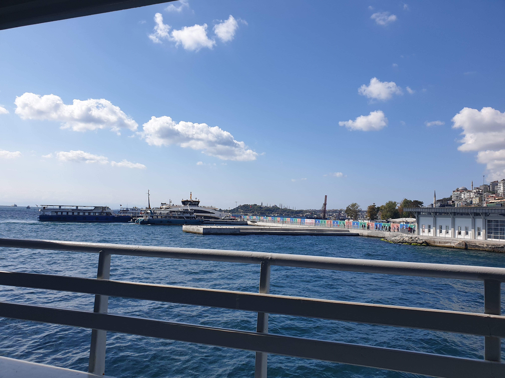
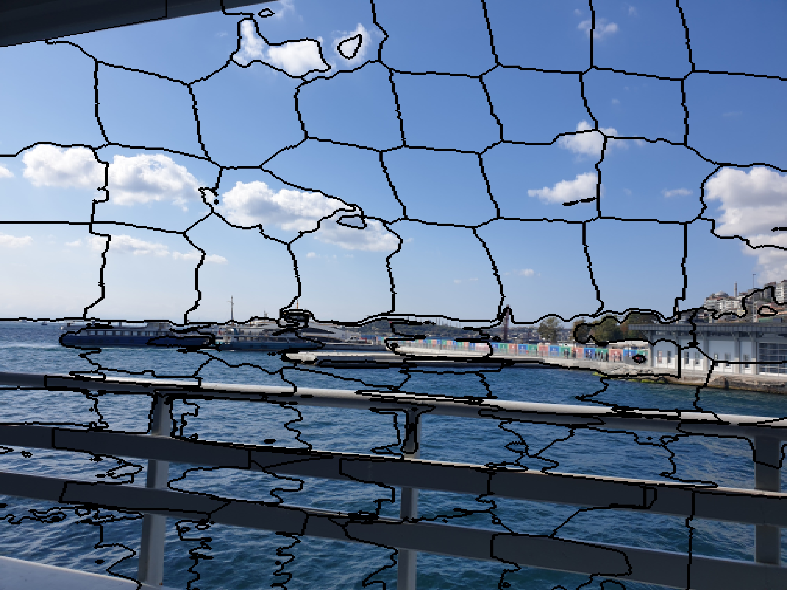
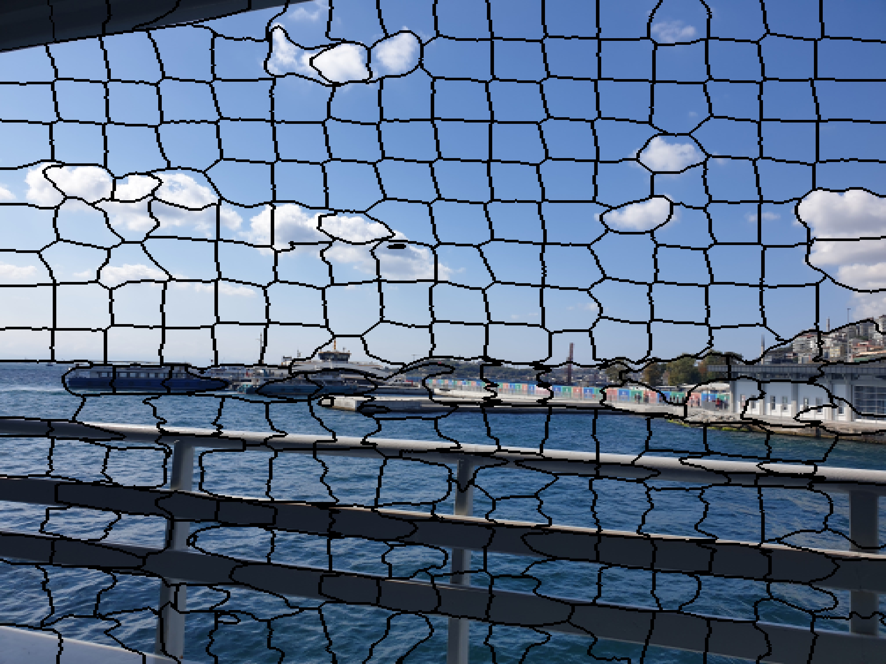
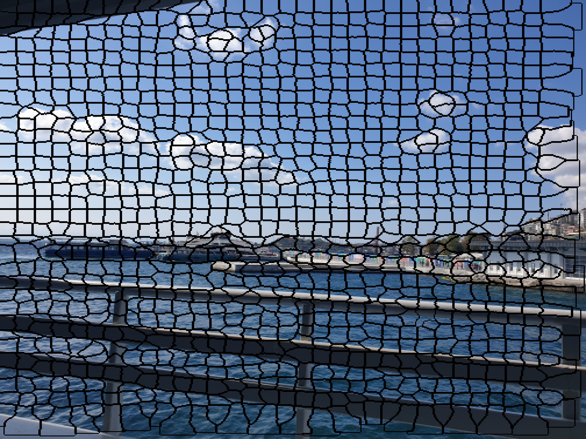
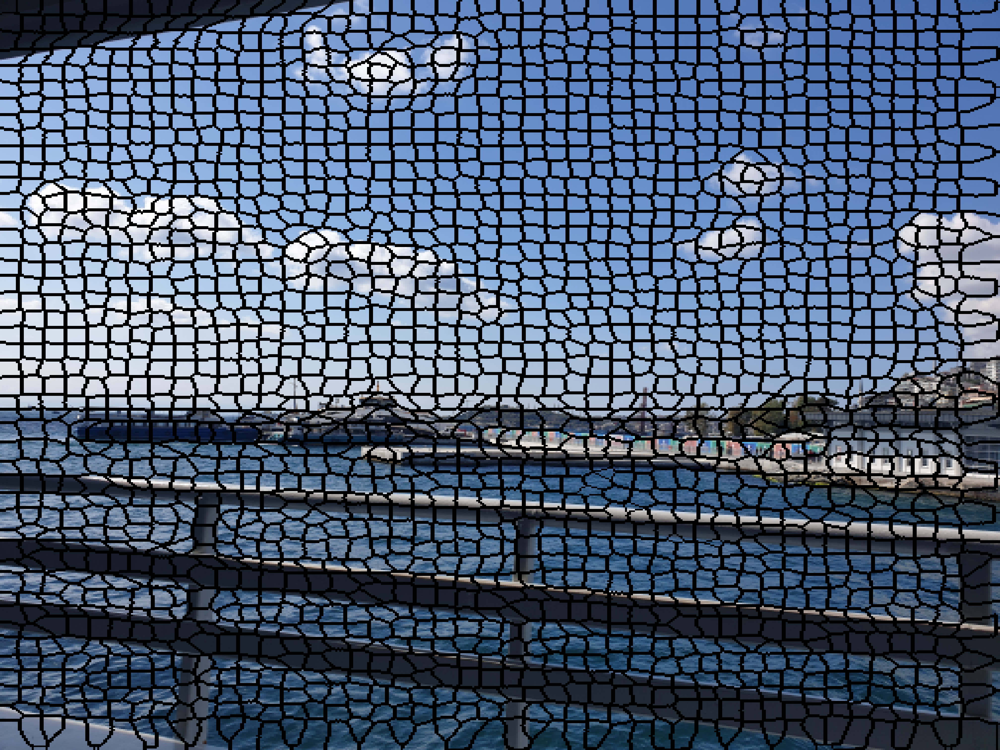

# SLIC-image-segmentation-implementation
This algorithm generates superpixels by clustering pixels based on their color similarity and proximity in the image plane. This is done in the five-dimensional [labxy] space, where [lab] is the pixel color vector in CIELAB color space and xy is the pixel position. in this project, we implemented this algorithm in python.

# Image to Segment

  

# Results

  
  
  
  

